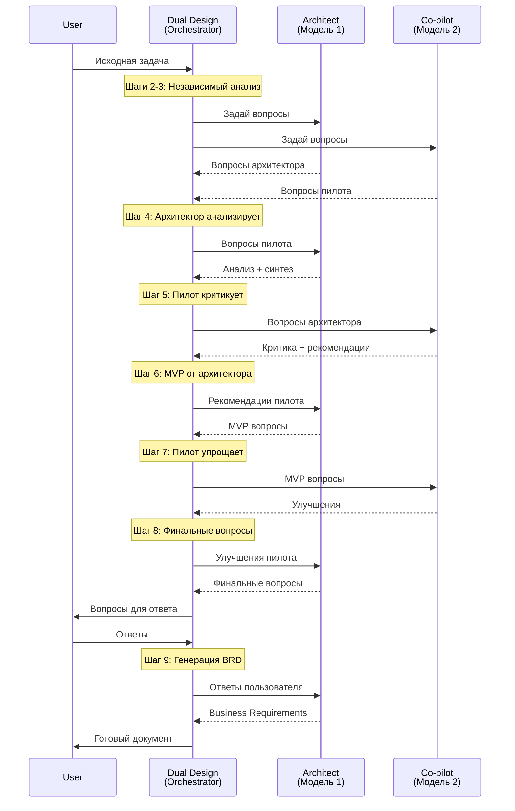

# Конфигурация моделей для Dual Design

## 🎛️ Как это работает

Режим **Dual Design** использует **два специализированных worker режима**, каждый из которых может быть настроен на использование **своей AI-модели**:

1. **dual-design-architect** - главный архитектор проекта
2. **dual-design-copilot** - критический аналитик (второй пилот)

Это позволяет получить **настоящую коллаборацию** между разными AI-моделями с разными подходами к решению задач.

---

## 🔧 Настройка моделей в Kilo Code

### Шаг 1: Откройте настройки режимов

В интерфейсе Kilo Code найдите секцию с настройками custom modes (пользовательских режимов).

### Шаг 2: Настройте Architect

Найдите режим **"Dual Design Architect"** и выберите модель:

**Рекомендуемые модели для Архитектора:**
- ✅ **Claude Sonnet 4** - отличный баланс скорости и качества
- ✅ **Claude Opus** - максимальное качество для сложных проектов
- ✅ **GPT-4o** - хорошая альтернатива с быстрым ответом

**Характеристики хорошего Архитектора:**
- Системное мышление
- Структурированный подход
- Фокус на практичности
- MVP-ориентированность

### Шаг 3: Настройте Co-pilot

Найдите режим **"Dual Design Co-pilot"** и выберите **другую** модель:

**Рекомендуемые модели для Пилота:**
- ✅ **GPT-4** - отлично находит edge cases
- ✅ **GPT-4o** - быстрый и критичный
- ✅ **Claude Opus** - глубокий анализ
- ✅ **Gemini Pro** - альтернативная перспектива

**Характеристики хорошего Пилота:**
- Критическое мышление
- Поиск рисков и проблем
- Альтернативные взгляды
- Внимание к деталям

---

## 🎯 Рекомендуемые комбинации

### Комбинация 1: Классика (Claude + GPT)
```
Architect:  Claude Sonnet 4
Co-pilot:   GPT-4o
```
**Почему:** Claude структурен и systematic, GPT хорош в поиске edge cases.

### Комбинация 2: Максимальное качество
```
Architect:  Claude Opus
Co-pilot:   GPT-4 Turbo
```
**Почему:** Две топовые модели, максимум инсайтов.

### Комбинация 3: Скорость + качество
```
Architect:  GPT-4o (fast)
Co-pilot:   Claude Sonnet 4
```
**Почему:** Быстрая итерация с качественной критикой.

### Комбинация 4: Альтернативная перспектива
```
Architect:  Claude Sonnet 4
Co-pilot:   Gemini Pro
```
**Почему:** Совершенно разные подходы к анализу задач.

---

## 📊 Сравнение характеристик моделей

| Модель | Роль | Системность | Критичность | Скорость | Стоимость |
|--------|------|-------------|-------------|----------|-----------|
| Claude Opus | Оба | ⭐⭐⭐⭐⭐ | ⭐⭐⭐⭐ | ⭐⭐⭐ | 💰💰💰 |
| Claude Sonnet 4 | Architect | ⭐⭐⭐⭐⭐ | ⭐⭐⭐⭐ | ⭐⭐⭐⭐ | 💰💰 |
| GPT-4 | Co-pilot | ⭐⭐⭐⭐ | ⭐⭐⭐⭐⭐ | ⭐⭐⭐ | 💰💰💰 |
| GPT-4o | Оба | ⭐⭐⭐⭐ | ⭐⭐⭐⭐ | ⭐⭐⭐⭐⭐ | 💰💰 |
| GPT-4 Turbo | Оба | ⭐⭐⭐⭐ | ⭐⭐⭐⭐ | ⭐⭐⭐⭐ | 💰💰 |
| Gemini Pro | Co-pilot | ⭐⭐⭐ | ⭐⭐⭐⭐ | ⭐⭐⭐⭐ | 💰 |

---

## 💡 Советы по выбору моделей

### Для простых проектов
```
Одинаковые модели (например, обе Claude Sonnet 4)
→ Достаточно для базовых требований
→ Дешевле
```

### Для средних проектов
```
Разные модели одного провайдера
Architect: Claude Sonnet 4
Co-pilot: Claude Haiku или Sonnet 3.5
→ Хороший баланс цены/качества
→ Разные перспективы
```

### Для сложных проектов
```
Разные провайдеры, топовые модели
Architect: Claude Opus
Co-pilot: GPT-4
→ Максимум инсайтов
→ Разные подходы к анализу
→ Лучшая критика
```

### Для экспериментов
```
Экзотические комбинации
Architect: GPT-4o
Co-pilot: Gemini Pro
→ Новые перспективы
→ Неожиданные инсайты
```

---

## 🔍 Как модели взаимодействуют



---

## 🎨 Примеры результатов с разными комбинациями

### Claude Sonnet 4 (A) + GPT-4o (C)

**Сильные стороны:**
- Структурированный и практичный подход от Claude
- Критическое мышление и edge cases от GPT
- Быстрая итерация
- Хороший баланс цена/качество

**Типичный результат:**
- 10-15 финальных вопросов
- Хорошая структура BRD
- Учтены основные риски
- MVP четко определен

### Claude Opus (A) + GPT-4 (C)

**Сильные стороны:**
- Глубокий анализ от обеих моделей
- Максимум инсайтов и деталей
- Учтены все edge cases
- Comprehensive coverage

**Типичный результат:**
- 15-20 финальных вопросов
- Очень детальный BRD
- Все риски документированы
- Альтернативные решения рассмотрены

### GPT-4o (A) + Gemini Pro (C)

**Сильные стороны:**
- Быстрая генерация
- Альтернативные перспективы
- Неожиданные инсайты от Gemini
- Экономичность

**Типичный результат:**
- 8-12 финальных вопросов
- Практичный BRD
- Интересные альтернативные идеи
- Focus на простоту

---

## ⚙️ Troubleshooting

### Модели дают слишком похожие результаты

**Проблема:** Обе модели предлагают одинаковые вопросы/анализ.

**Решение:**
1. Используйте модели от разных провайдеров
2. Попробуйте Claude + GPT или Claude + Gemini
3. Убедитесь что промты различаются (должны автоматически)

### Результаты слишком поверхностные

**Проблема:** Недостаточно глубины анализа.

**Решение:**
1. Используйте более мощные модели (Opus, GPT-4)
2. Дайте более детальное описание задачи
3. Попробуйте режим с одинаковыми топовыми моделями

### Слишком много вопросов (>20)

**Проблема:** Финальный список раздут.

**Решение:**
1. В исходном запросе подчеркните фокус на MVP
2. Используйте быстрые модели (они pragmatic)
3. Попробуйте GPT-4o для обеих ролей

### Модели конфликтуют

**Проблема:** Architect и Co-pilot сильно противоречат друг другу.

**Решение:**
1. Это нормально! Противоречия - это ценность
2. Архитектор должен синтезировать perspectives
3. Если проблема критична - используйте более balanced модели

---

## 📝 Примеры настроек для разных сценариев

### Стартап (быстро и дешево)
```yaml
Architect: GPT-4o
Co-pilot: GPT-4o
Время: ~5 минут
Стоимость: ~$0.50
```

### Корпоративный проект (качество важнее)
```yaml
Architect: Claude Opus
Co-pilot: GPT-4
Время: ~10 минут
Стоимость: ~$2.00
```

### Критическая система (максимум)
```yaml
Architect: Claude Opus
Co-pilot: GPT-4 + ручная review
Время: ~15 минут
Стоимость: ~$3.00
```

### Исследовательский проект
```yaml
Architect: Claude Sonnet 4
Co-pilot: Gemini Pro
Время: ~7 минут
Стоимость: ~$0.80
```

---

## 🚀 Getting Started

1. **Перезагрузите VSCode** после изменений в `.kilocodemodes`
2. **Откройте настройки Kilo Code**
3. **Найдите секцию Custom Modes**
4. **Настройте модели** для:
   - Dual Design Architect
   - Dual Design Co-pilot
5. **Запустите первую сессию** в режиме Dual Design
6. **Экспериментируйте** с разными комбинациями!

---

## 💬 FAQ

**Q: Можно ли использовать одну и ту же модель для обеих ролей?**  
A: Да, но эффект коллаборации будет меньше. Рекомендуется использовать разные модели.

**Q: Какая комбинация лучшая?**  
A: Зависит от задачи. Для большинства случаев: Claude Sonnet 4 (Architect) + GPT-4o (Co-pilot).

**Q: Можно ли менять модели между сессиями?**  
A: Да! Экспериментируйте с разными комбинациями.

**Q: Влияет ли выбор модели на формат BRD?**  
A: Нет, структура BRD одинаковая. Меняется только глубина и стиль анализа.

**Q: Можно ли использовать локальные модели?**  
A: Зависит от возможностей Kilo Code. Обычно поддерживаются OpenAI, Anthropic, Google.

---

## 📚 Дополнительные ресурсы

- [Основная документация](README.md)
- [Быстрый старт](QUICK_START_DUAL_DESIGN.md)
- [Техническая спецификация](dual-design-spec.md)
- [История изменений](CHANGELOG.md)

**Удачных экспериментов! 🎉**